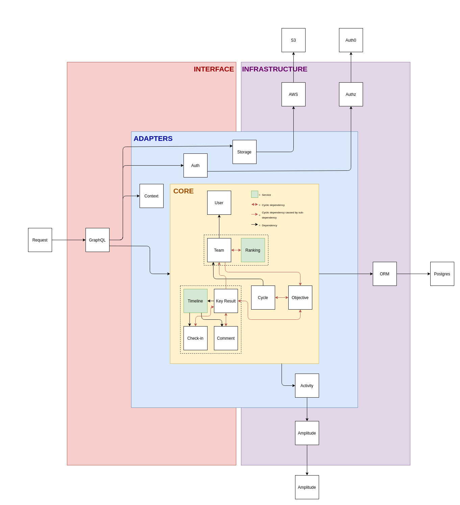

# ADR 1: Model Overview

- [Table of contents](#)
  - [Context](#context)
  - [Decision](#decision)
  - [Status](#status)
  - [More reading](#more-reading)

## Context

Understanding any software emergency attributes is complicated. Any application can grow exponentially and become extremely hard to understand. Also, there is a massive gap between the engineering understanding of any product and the business team.

## Decision

To reduce that gap, we've decided to use the Domain-Driven Design technique (as you can see in [ADR#0003](0003-domain-driven-design.md)).

We've divided our domain architecture into two scopes:

1. **Model Overview:** As you can see here, an overview of our architecture, considering only the most relevant entities.
2. **Local Domain Overview:** Every other file in this `domain` folder. They're only considering their domain, with a more detailed view and exploring their inner objects and considering only external entities that affect them.

## Status

Always changing.

## Consequences

The primary consequence we can have is an outdated domain architecture. So, keep it simple to update. Nothing lasts forever, so our domain architecture changes every day.
