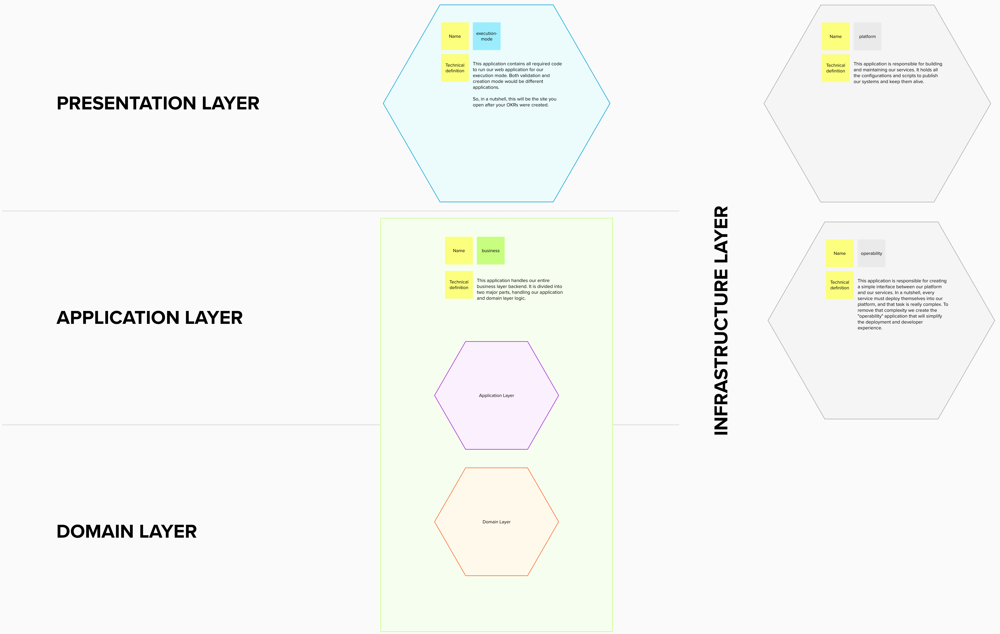

# ADR 1: Overview

* [Table of contents](#)
  * [Context](#context)
  * [Decision](#decision)
  * [Status](#status)
  * [Consequences](#consequences)
  * [More reading](#more-reading)
  * [Updates](#updates)

## Context

Dealing with microservices is a complicated task. We always have the risk of losing control while creating new structures. We must keep track of our current architecture, understanding their domains and context boundaries.

## Decision

Within this ADR, we're going to keep an overview of our current microservices architecture. Each application has a pre-defined boundary, as well as a well-defined technical definition.

You can take a look at our [live architecture](https://app.mural.co/t/d4c6342/m/d4c6342/1602612797113/5836de51b220fa5ebc8cefd7ad0f161125610524) or check the diagram below:

## Status

Accepted.

## Consequences

Since we're documenting our microservices infrastructure, we must keep this document updated and all developers knowing the current state of our architecture.

---

## More reading

* [Live architecture](https://app.mural.co/t/d4c6342/m/d4c6342/1602612797113/5836de51b220fa5ebc8cefd7ad0f161125610524)

## Updates

### Update 1

After [business/ADR#001](../business/001-reducing-initial-complexity.md), we've decided to merge our application and domain app into a single business application and also remove our design-system application from our initial structure. Take a look at that ADR for more context.
